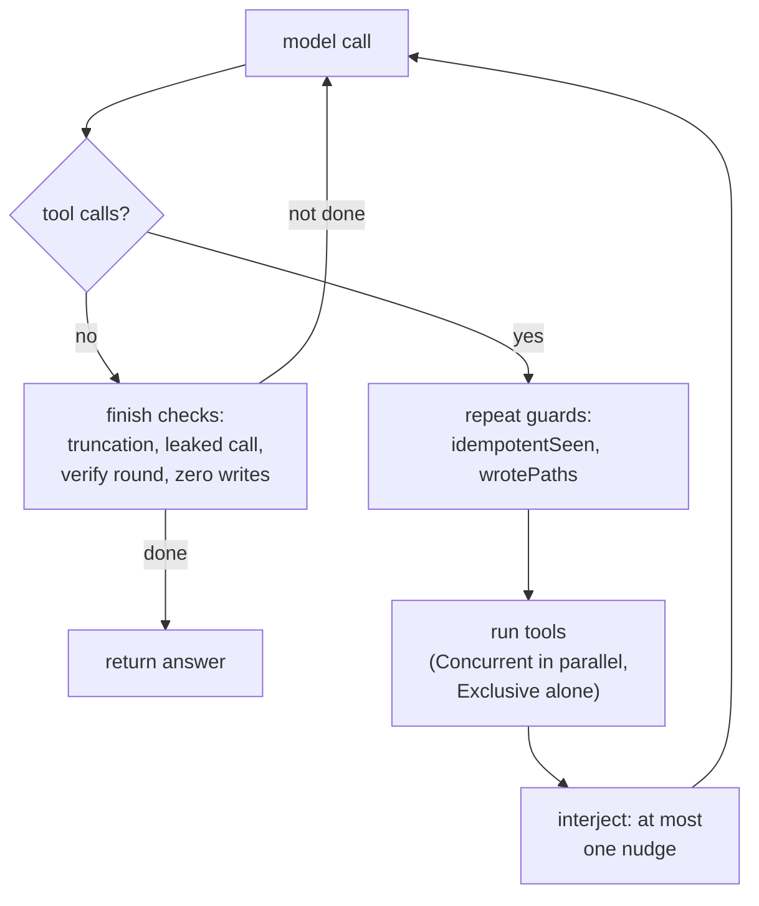

# Architecture

> Installation, flags and usage live in [README.md](README.md). House rules and
> what the build enforces live in [docs/conventions.md](docs/conventions.md).
> This document covers how the system works.

TARS runs one agent loop. Everything else decides how that loop is configured,
what it is allowed to touch, and whether its output is real.

The organising idea: a small local model is unreliable at knowing whether it did
the work, so nothing in the design asks it. Completion is measured by running a
command or reading a file, never by reading the model's report.

## Package map

```
cmd/agent          CLI: flags, the approval gate, console output
cmd/eval           probe runner and scorer

internal/agent     the loop. Tool interface, Registry, repeat detection,
                   budgets, history compaction. Knows nothing about
                   koboldcpp or the filesystem.
internal/llm       Client interface, one backend, the GBNF grammar.
                   Every backend quirk lives here.
internal/tools     concrete tools: file, shell, search, process, delegation
internal/roles     the four kinds of agent this project builds
internal/mission   plan, ledger, workers, checks, replan, review
internal/prompts   every prompt, as .txt, embedded at build time
internal/workspace path resolution for the file tools
```

`llm`, `prompts` and `workspace` import no other internal package. `agent`
imports only `llm` and `prompts`, which is why `tools` can implement
`agent.Tool` without a cycle. `roles` sits above both because it needs each.

## The loop

One model call per step. The response either requests tools or does not, and
those are different paths.



### Judging a step

Four pieces of state decide whether a step made progress, and they answer
different questions:

| State | Question |
|---|---|
| `idempotentSeen` | has this exact read already run with nothing changed since? |
| `wrotePaths` | has this path already been written this run? |
| `stuckSteps` | how many consecutive steps produced no useful result? |
| `exploratorySteps` | how many consecutive steps changed nothing on disk? |

The first two are **hard guards**: a repeat comes back as an error result, so
the model must do something else. Errors do not count as progress, so the stuck
counter keeps climbing if it will not change course.

The last two feed **soft nudges**, and `interject` emits at most one per step,
ranked by severity. Several used to fire together, which meant a worker could
be told to broaden its search and to stop searching in the same breath.

Repeat detection canonicalizes arguments before comparing. `{"path":"x"}` and
`{"path": "x", "metadata_only": false}` are the same call spelled two ways, and
a weak model rarely spells one the same way twice.

### Finishing

A turn with no tool calls is not automatically an answer. Before one is
accepted the loop rules out: generation truncated by the token budget, a
tool call written as plain text instead of a structured call, a pending verify
round, and — when the run was supposed to write files — a finish with nothing
written. That last case is refused up to `MaxZeroWriteRefusals` times, quoting
the model's own closing sentence back at it.

### Budgets

Every bound has a default in `agent.New` or the `Runner` methods: 25 steps per
run, 15 per mission worker, 12 per subagent, 8 per inspector, 8192 generation
tokens, 2 stuck steps before a nudge, 2 fix attempts and 1 replan per mission.
Total worker runs per mission are bounded by construction:
`subtasks × (1 + fixes) × (1 + replans)`.

## The four roles

`internal/roles` is the only place that constructs an agent, so "what is a
subagent allowed to do" has one answer rather than one per call site.

| Role | Tools | Bounded by |
|---|---|---|
| `Inspector` | read-only | 8 steps |
| `Subagent` | full set, no delegation or ask_user | 12 steps |
| `Worker` | full set, no delegation | mission's worker budget |
| `Interactive` | full set plus ask_user and delegate_task | run budget |

An inspector gets a registry without the mutating tools rather than a prompt
asking it not to mutate. A subagent cannot delegate, so delegation cannot
recurse.

## Mission mode

A mission is a state machine over phases — `explore`, `plan`, `execute`,
`verify`, `done`, `failed` — persisted to `.agent/tasks/<id>/mission.json`
after every transition. The model never chooses the next phase. Resume is
"load, switch on phase, continue".

Each subtask runs in a fresh context compiled from the ledger, not inherited
from the previous worker's transcript. A worker that fills its context with
grep output does not poison the plan.

### Checks

A subtask declares how it will be verified: `file_exists`, `content_contains`,
`shell`, `http` or `none`. The plan is rejected before a human sees it if two
subtasks share a check, if a subtask reads without producing anything, or if a
shell check cannot fail.

The checks are the weak point of the design, not its strength: the model writes
them, and a model that writes its own exam writes an easy one. Validation
catches the known-bad shapes. It does not catch a check that is merely weaker
than the acceptance criteria beside it.

### Fix and replan

A failed check starts a fresh fix worker seeded with the check's real output.
When fix attempts run out, the remaining work is replanned once. Both budgets
are small on purpose: a subtask needing many attempts is usually a planning
failure, and more attempts will not fix a plan.

## The backend boundary

`internal/llm` owns every backend quirk. Two are worth knowing about:

**Grammar.** Requests carry a GBNF grammar that blocks a model from emitting
its native tool-call template as plain text. It constrains the first character
only; it is a patch for two observed shapes, not a response envelope.

**koboldcpp decides tool calls itself.** The server runs its own reasoning pass
to choose whether to emit a tool call and which one. That decision is not
visible to this harness and cannot be constrained by the grammar above. Owning
it means moving to `/api/v1/generate` and taking on per-model chat templating.

## Evals

`eval/probes/*.json` are scenarios with frozen pass criteria, scored three
ways: what the workspace contains, which tools were used, and what the run
reported. Each runs in a throwaway copy of its seed, so fixtures cannot be
mutated by a run. See [eval/README.md](eval/README.md).

The criteria are frozen by hand rather than derived from the mission's own
checks, for the reason given under Checks above.

## Tried and rejected

**Soft nudges alone.** Telling a model it is repeating itself does not stop it
repeating itself. Repeats that can be detected are now refused as errors;
nudges remain only for patterns that cannot be.

**One shared transcript across subtasks.** Context filled with one worker's
exploration, and later workers inherited it. Workers now start from a compiled
seed.

**Trusting `finish_reason` alone.** A truncated generation and a completed one
both arrive as a message with no tool calls, and the truncated one usually
contains the announcement of the call that got cut off.

**Counting repeated tool names as a loop.** Writing four different files in a
row is four `write_file` calls and is also the normal shape of scaffolding
work. Repeat detection compares arguments, not names.

## Known limitations

- `internal/workspace` bounds the file tools. `run_shell` sets a working
  directory and nothing else, so the workspace is a guardrail against a
  mistyped path, not a sandbox.
- Plan quality is the ceiling. Most mission failures are a bad plan executed
  faithfully, not a subtask executed badly.
- Mission checks are chosen by the model. See Checks.
- Windows-first. The shell tools pick `cmd.exe` or `sh` by OS, but see less
  testing elsewhere.
